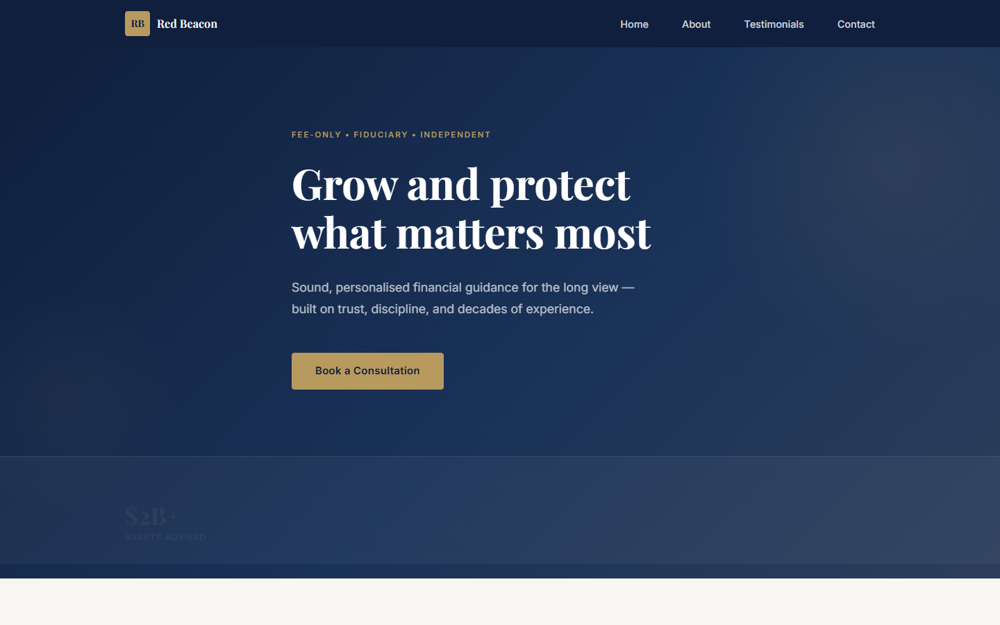

# Red Beacon Asset Management

A single-page investment advisory website for **Red Beacon Asset Management** — a fee-only, fiduciary wealth management firm. The site is designed as a lead magnet, guiding visitors toward a complimentary 30-minute strategy session via an enquiry form. It features a forest-green-and-gold brand theme, scroll animations, a testimonial carousel, a free guide offer section, and a two-column contact layout with social proof.



## Live Site

[https://cscht9whcw-code.github.io/rbadvisory/](https://cscht9whcw-code.github.io/rbadvisory/)

## Tech Stack

Vanilla HTML5, CSS3, and JavaScript — no frameworks, no build tools, no package.json. Google Fonts (Playfair Display + Inter). Form delivery via [FormSubmit](https://formsubmit.co/) (AJAX, no backend required).

## Project Structure

```
index.html                  # All markup — 7 sections: hero, about, services, guide, testimonials, contact, footer
styles.css                  # Mobile-first; all design tokens in :root custom properties at the top
script.js                   # Four IIFEs: navbar, smooth scroll, IntersectionObserver reveal, carousel + form handler
.github/
  workflows/
    deploy.yml              # GitHub Actions — deploys to GitHub Pages on every push to main
```

## Features

- **Lead magnet hero** — full-viewport gradient with stats bar and "Claim Your Free Strategy Session" CTA
- **Free Guide section** — CSS book-cover mockup, benefit checklist, scroll-to-form CTA
- **Two-column contact form** — benefits sidebar (session value list, availability notice, client quote) + validated form
- **Testimonial carousel** — auto-advances every 5 s, pauses on hover, keyboard accessible
- **Scroll-reveal animations** — IntersectionObserver fades/slides all `.reveal` elements into view
- **Sticky navbar** — hamburger menu on mobile, gold CTA button on desktop
- **Responsive** — mobile-first, breakpoints at 580 px / 768 px / 900 px / 1024 px
- **WhatsApp chat widget** — fixed floating button (bottom-right) with pre-filled suggestive query chips that open WhatsApp directly
- **Accessible** — ARIA labels, keyboard focus, `prefers-reduced-motion` respected

## Running Locally

Open `index.html` directly in a browser for layout and animation work.

For the enquiry form (which uses `fetch`), serve over HTTP:

```bash
npx serve .
```

Or use VS Code Live Server. The form will silently fail on `file://` origins.

> **First submission:** FormSubmit sends a one-time confirmation email to the recipient. Click that link to activate delivery before testing live submissions.

## Deployment

Pushing to `main` automatically triggers the GitHub Actions workflow at `.github/workflows/deploy.yml`, which deploys the site to GitHub Pages. No manual steps required.
